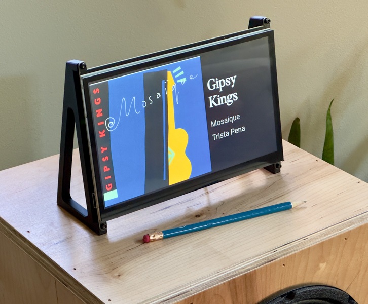
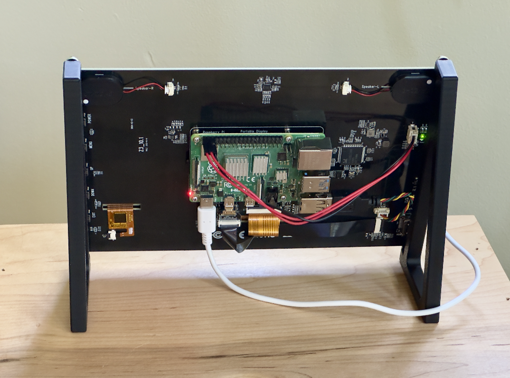

# roFrame - A Picture Frame with Roon Display

A simple digital frame that shows "Now Playing" information from a Roon audio zone. It communicates with Roon as an extension. When music is not playing, it cycles through a user-defined slideshow of images.

## Features

- Connection: Connects to Roon over Wi-Fi as an extension, so only a power cable is needed, and it can be placed where you like to see it.
- Slideshow: Displays images from a local pictures directory when no music is playing.
- Roon Metadata: Shows currently playing track information (artist, track title, album art, etc.) for a chosen Roon zone.
- Kiosk Mode: Automatically launches in a full-screen browser on Raspberry Pi OS (with optional display power management).
- Lightweight: Uses a simple Python app and minimal services to run efficiently on a Raspberry Pi.

## Setup

Assuming you have freshly installed the latest Raspberry Pi OS Lite on an SD card, enabled Wi-Fi and SSH access, and opened a remote terminal to the board.

### Install Application

Update OS and install required packages:

    sudo apt update
    sudo apt install -y git

Install application:

    mkdir ~/work
    cd ~/work
    git clone https://github.com/igfarm/roFrame
    cd roFrame
    python -m venv venv
    source venv/bin/activate
    pip install -r requirements.txt

Make a copy of the configuration and modify it as needed:

    cp .env.example .env
    nano .env

Start the discovery program, and go to Roon extensions to approve it:

    python discovery.py

Add a few images to the `pictures` folder. In my case, the panel I am using has a resolution of 1024x600, so pictures should be that size. If you don't do this step, you will be rewarded with some modern art on your frame.

Test that things are working as expected by starting the frame application:

    python app.py

and open a browser and open the URL of the machine the app is running on as indicated when running the app.

### Install and configure OS

Install required packages:

    sudo apt update
    sudo apt install -y xserver-xorg xinit chromium-browser unclutter

Create an `.xinit` file that `startx` will execute once it starts running:

    cat << EOF > ~/.xinitrc
    #!/bin/bash

    # A small wait to make sure needed services have started
    sleep 10

    # Disable mouse and power management
    unclutter -idle 0.1 -root &
    xset dpms 0 0 0
    xset -dpms      # Disable power management
    xset s off      # Disable screen saver
    xset s noblank  # Prevent screen blanking

    # Start Chromium in kiosk mode
    exec chromium-browser --noerrdialogs --disable-infobars --hide-scrollbars --kiosk "http://127.0.0.1:5006"
    EOF

    chmod +x ~/.xinitrc

Install the application's service:

    cd ~/work/roFrame

    sudo cp frame.service /lib/systemd/system/
    sudo sed -i "s|PATH|$(pwd)|g" /lib/systemd/system/frame.service
    sudo sed -i "s|USER|$(whoami)|g" /lib/systemd/system/frame.service
    sudo systemctl enable frame.service

Install the kiosk service:

    sudo cp kiosk.service /lib/systemd/system/
    sudo sed -i "s|USER|$(whoami)|g" /lib/systemd/system/kiosk.service
    sudo systemctl enable kiosk.service

Allow `startx` to be started by a service:

    sudo sed -i "s|allowed_users=console|allowed_users=anybody|g" /etc/X11/Xwrapper.config

Reboot the Pi:

    sudo reboot

The frame should come up and you should see some pictures on the screen.

## Hardware

In my case, this is what I used:

- Raspberry Pi 4 with 2GB RAM - https://www.adafruit.com/product/4292
- 10.1" display - https://www.amazon.com/dp/B09XDK2FRR

## Acknowledgments

- https://github.com/geerlingguy/pi-kiosk - Inspiration on setting up Kiosk mode
- https://github.com/pavoni/pyroon - Python interface to Roon Core
- https://darko.audio/2025/03/how-to-put-roons-now-playing-screen-on-a-tv-or-monitor/ - Article that gave me the idea of creating this app.

## License

[Apache 2.0](LICENSE)

## Author

This project was created by Jaime Pereira in 2025.
