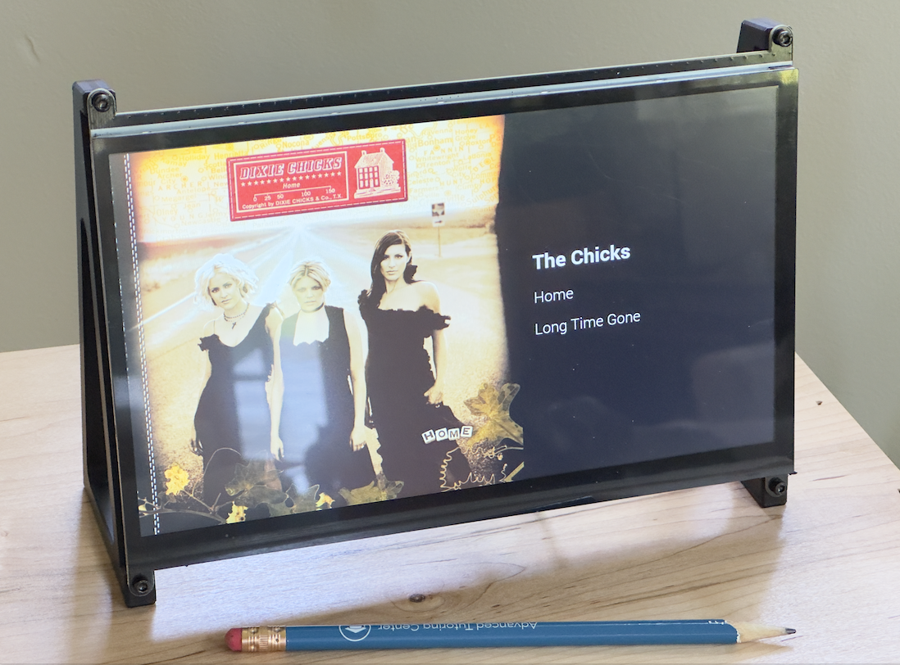

# roFrame - A Picture Frame with Roon Display

A simple digital frame which has the ability to display what's playing on a Roon zone. When not playing music it cycles through pictures.

## Setup

Starting with the latest Raspberry Pi OS, desktop edition, open a terminal window and install project and requirements:

    mkdir ~/work
    git clone https://github.com/igfarm/roFrame
    sudo apt install unclutter
    python -m venv venv
    source venv/bin/activate
    pip install -r requirements.txt

Make a copy of the configuration and edit as need:

    cp .env.example .env
    nano .env

Start the discovery program, and go to Roon extensions to approve it.

    python discovery.py

Add a few images to the `pictures` folder. In my case the panel I am using has a resolution of 1024x600, so pictures should be that size.

Test that things are working as expect by staring the frame application

    python app.py

and open a browser and open the URL of the machine app is running as indicated when running app.

If you want the application to control when the display is on and off, you will need to enable `DISPLAY_CONTROL=on` on the .env file. Recent versions of Raspbian use the Wayland window manager which does not support dump. Switch to X11 using rapi-config -> Advanced Options -> Wayland.

Install the services needed:

    # Kiosk service
    sudo cp kiosk.service /lib/systemd/system/
    sudo sed -i "s|PATH|$(pwd)|g" /etc/systemd/system/kiosk.service
    sudo sed -i "s|USER|$(whoami)|g" /etc/systemd/system/kiosk.service
    sudo systemctl enable kiosk.service
    sudo systemctl start kiosk.service

    # Frame service
    sudo cp frame.service /lib/systemd/system/
    sudo sed -i "s|PATH|$(pwd)|g" /etc/systemd/system/frame.service
    sudo sed -i "s|USER|$(whoami)|g" /etc/systemd/system/frame.service
    sudo systemctl enable frame.service
    sudo systemctl start frame.service

And reboot the PI and it should some up by itself.

    sudo reboot

## Hardware

In my case, this is what I used:

- Raspberry Pi 4 with 2GB RAM - https://www.adafruit.com/product/4292
- 10.1" display - https://www.amazon.com/dp/B09XDK2FRR

## Acknowledgments

- https://github.com/geerlingguy/pi-kiosk - Inspiration on setting up Kiosk mode
- https://github.com/pavoni/pyroon - Python interface to Roon Core

## License

[Apache 2.0](LICENSE)

## Author

This project was created by Jaime Pereira in 2025.
